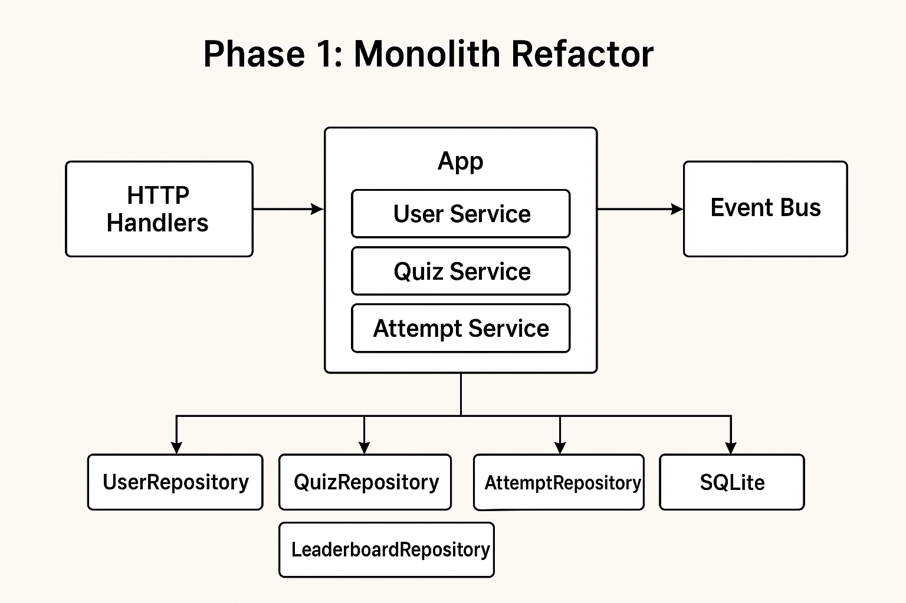

Perfect — let’s map **Phase 1** in detail. The goal here is **refactoring your monolith** so it’s ready for eventual microservices and cloud migration, without changing the fact that it’s still a single binary. We’re focusing on **architecture/structure**, not writing actual code yet.

---

## **Phase 1: Monolith Refactor Plan**

### **Objectives**

1. **Decouple business logic from persistence** (Repository Pattern).
2. **Introduce an event-driven mindset** via an Event Bus interface.
3. Keep the app **fully functional locally** with SQLite and local LLM.
4. Lay the groundwork so services can eventually be split cleanly.

---

### **Step 1: Identify Domains & Boundaries**

Even in the monolith, treat each domain as if it were a service. Your current domains:

* **User** → registration, login, profile.
* **Quiz** → daily quiz generation (LLM), question management.
* **Attempt** → storing user attempts at quizzes, scoring.
* **Leaderboard** → ranking users, aggregating scores.

**Action:**

* Create separate **packages** for each domain (`internal/user`, `internal/quiz`, `internal/attempt`, `internal/leaderboard`).
* Move existing code logically into these packages, keeping **handlers** thin.

---

### **Step 2: Introduce Repository Interfaces**

Currently your HTTP handlers likely talk directly to SQLite/sqlc.

**Goal:** abstract database access.

**Action Plan:**

1. Define **repository interfaces** per domain, e.g.:

```text
UserRepository:
  - CreateUser(user) error
  - GetUserByID(id) (*User, error)
  
QuizRepository:
  - CreateQuiz(quiz) error
  - GetDailyQuiz(date) ([]Question, error)

AttemptRepository:
  - RecordAttempt(attempt) error
  - GetAttemptsForUser(userID) ([]Attempt, error)

LeaderboardRepository:
  - GetLeaderboard() ([]LeaderboardEntry, error)
```

2. Implement **SQLite/sqlc versions** of these repositories.
3. Handlers now depend on **interfaces**, not concrete DB code.

> ✅ Benefit: later you can swap SQLite → Azure SQL without touching handlers.

---

### **Step 3: Introduce Event Bus Interface**

Even before deploying microservices, we can start **publishing events internally**.

**Action Plan:**

1. Define an **EventBus interface**:

```text
Publish(event Event) error
Subscribe(eventType string, handler func(Event)) error
```

2. Create a **local implementation**: simple in-memory pub/sub or lightweight RabbitMQ/NATS for local testing.
3. Domain logic emits events for key actions:

* User → `UserRegistered`
* Quiz → `DailyQuizGenerated`
* Attempt → `QuizAttemptEvaluated`

> ✅ Benefit: code already uses events, so splitting into microservices later is easier.

---

### **Step 4: Thin Handlers / Service Layer**

Currently, your handlers likely mix HTTP + DB + LLM logic.

**Action Plan:**

1. Move all business logic into **domain services**:

```text
internal/quiz/service.go
func GenerateDailyQuiz(userID string) ([]Question, error) { ... }

internal/attempt/service.go
func SubmitAttempt(userID, quizID string, answers []Answer) (Score, error) { ... }
```

2. Handlers only call **services** and handle HTTP response formatting.

> ✅ Benefit: handlers are lightweight, services are testable, and ready for future split.

---

### **Step 5: Prepare Config & DI**

Introduce **dependency injection** for:

* Repositories
* Event bus
* LLM engine

Example:

```text
type App struct {
  UserRepo      UserRepository
  QuizRepo      QuizRepository
  AttemptRepo   AttemptRepository
  Leaderboard   LeaderboardRepository
  EventBus      EventBus
  LLM           QuizGenerator
}
```

Handlers then get a reference to `App`.

> ✅ Benefit: swapping components (local LLM → Azure OpenAI) becomes trivial.

---

### **Step 6: Tests**

* Write **unit tests** for domain services using **mock repositories**.
* Write **integration tests** for handlers using **in-memory DB**.

> This ensures your refactor preserves correctness before moving to microservices.

---

### **Step 7: Optional – Local Event-Driven Simulation**

* If desired, spin up **local RabbitMQ or NATS** via Docker.
* Replace in-memory EventBus with a **local broker adapter**.
* Keep everything functional within a single Go binary.

---

### **Phase 1 Outcome**

By the end of Phase 1, your monolith:

* Has **domain-separated packages**.
* Uses **repository pattern** for persistence.
* Uses **event bus abstraction** for internal events.
* Has **thin handlers and testable services**.
* Is **ready for microservices split** and cloud infra swap.

---

If you want, I can **draw a visual “Phase 1 architecture diagram”** showing packages, repositories, services, event bus, and how handlers interact — this makes it very clear what refactor looks like.

Do you want me to do that next?


