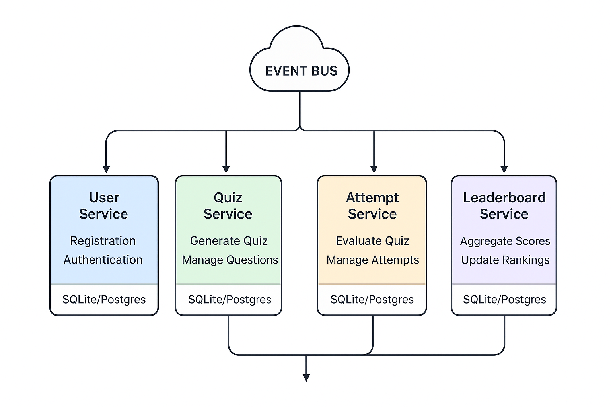

Perfect — thanks for clarifying. Since you want a **Phase 2 plan**, the focus is on **splitting your monolith into multiple local microservices** while still keeping it simple, repeatable, and development-friendly. Here's a detailed, structured **plan of action**:

---

# Phase 2 – Local Microservices Implementation Plan

## **Goal**

Transition from a single monolithic Go app to multiple local microservices communicating via a local event bus. Keep persistence simple (SQLite or local Postgres) and simulate the cloud environment without deploying to Azure yet.

---

## **Step 1 — Identify Service Boundaries**

Split your monolith into small, logical services:

| Service                 | Responsibility                                                      | Core Entities  |
| ----------------------- | ------------------------------------------------------------------- | -------------- |
| **User Service**        | Manages registration, authentication (mock AD B2C), profile updates | User           |
| **Quiz Service**        | Generates quizzes using LLM, manages questions                      | Quiz, Question |
| **Attempt Service**     | Handles quiz attempts, scoring, results                             | Attempt, Score |
| **Leaderboard Service** | Aggregates attempts and rankings                                    | Leaderboard    |

**Action Items:**

* Decide which HTTP endpoints move to each service.
* Define which events each service **publishes** and **subscribes**.

---

## **Step 2 — Introduce a Local Event Bus**

Even locally, the services should communicate via events.

**Options (for local dev):**

* RabbitMQ (Docker)
* NATS (lightweight, good Go support)
* Kafka (overkill for now, optional)

**Key Events to Define:**

1. `UserRegistered` → published by User Service → consumed by Quiz Service to generate initial quizzes.
2. `DailyQuizGenerated` → published by Quiz Service → consumed by Attempt Service.
3. `QuizAttemptEvaluated` → published by Attempt Service → consumed by Leaderboard Service.

**Action Items:**

* Create a shared **event struct library** for type-safe events.
* Implement a local Event Bus interface (`Publish`, `Subscribe`) used by all services.

---

## **Step 3 — Extract Repository Interfaces**

Before splitting, ensure each service has a **repository layer**:

* `UserRepository` → methods: `CreateUser`, `GetUser`, `ListUsers`.
* `QuizRepository` → methods: `CreateQuiz`, `GetQuizByDate`, `ListQuizzes`.
* `AttemptRepository` → methods: `CreateAttempt`, `GetAttemptsByUser`.
* `LeaderboardRepository` → methods: `GetLeaderboard`, `UpdateLeaderboard`.

**Action Items:**

* Keep repository interfaces **shared** (in a common module or package) to ease future database swaps.
* Implement SQLite or Postgres adapters per service.

---

## **Step 4 — Split the Monolith**

Create separate Go modules/repositories for each service:

```
/services
  /user
  /quiz
  /attempt
  /leaderboard
/shared
  /events
  /repositories
/docker
  docker-compose.yml
```

**Action Items:**

* Move the relevant handlers, repository implementations, and models to each service.
* Each service should run independently on a unique port.
* Services should not directly call each other’s methods; **all communication via events**.

---

## **Step 5 — Dockerize for Local Development**

**Docker Compose Setup:**

* Event bus (RabbitMQ or NATS)
* SQLite/Postgres (shared or per service)
* Each service containerized with a simple `Dockerfile`

**Example Ports:**

* User Service → `:8081`
* Quiz Service → `:8082`
* Attempt Service → `:8083`
* Leaderboard Service → `:8084`
* RabbitMQ → `:5672`

**Action Items:**

* Make services read DB and event bus URLs from env variables.
* Ensure event subscriptions are established on service startup.

---

## **Step 6 — Implement Event-Driven Flows**

**Example Flow:**

1. User registers → `UserRegistered` event published.
2. Quiz Service listens → generates daily quiz → publishes `DailyQuizGenerated`.
3. Attempt Service listens → user submits attempt → publishes `QuizAttemptEvaluated`.
4. Leaderboard Service listens → updates rankings.

**Action Items:**

* Implement logging to verify event flows locally.
* Mock OpenAI/LLM locally until Phase 3.

---

## **Step 7 — Validate End-to-End**

* Run all services via Docker Compose.
* Simulate user registration, quiz generation, attempt submission.
* Ensure leaderboard updates correctly through event flow.
* Confirm services are decoupled — no direct method calls between them.

---

## **Optional Enhancements**

* Add **HTTP gateway**: a simple API gateway service that proxies requests to each microservice for easier testing.
* Introduce **health checks** per service.
* Implement **retry logic** in event consumers for robustness.

---

✅ **Outcome of Phase 2**

* Fully decoupled local microservices.
* Event-driven communication in place.
* Clear boundaries for services, repositories, and event handling.
* Ready to lift into Azure (Phase 3) with minimal changes.

---

| Step                         | Task                                                                                    | Notes / Deliverables                                            |
| ---------------------------- | --------------------------------------------------------------------------------------- | --------------------------------------------------------------- |
| **1. Define Services**       | Identify boundaries: User, Quiz, Attempt, Leaderboard                                   | Create separate folders/modules for each service                |
| **2. Define Events**         | List all domain events (`UserRegistered`, `DailyQuizGenerated`, `QuizAttemptEvaluated`) | Create shared event structs in `/shared/events`                 |
| **3. Extract Repositories**  | Introduce repository interfaces per service                                             | SQLite/Postgres adapters; interface separation from handlers    |
| **4. Split Monolith**        | Move relevant handlers, models, repositories to their service modules                   | Ensure no direct method calls across services                   |
| **5. Local Event Bus**       | Set up RabbitMQ/NATS via Docker Compose                                                 | Implement a shared Event Bus interface (`Publish`, `Subscribe`) |
| **6. Dockerize Services**    | Create Dockerfiles per service; Docker Compose for all services + event bus + DB        | Ports: User 8081, Quiz 8082, Attempt 8083, Leaderboard 8084     |
| **7. Implement Event Flows** | Connect publish/subscribe logic                                                         | Ensure each event triggers correct downstream behavior          |
| **8. Validate End-to-End**   | Test registration → quiz → attempt → leaderboard                                        | Logging and test scripts to verify event flow                   |
| **9. Optional Enhancements** | API Gateway, health checks, retry logic in consumers                                    | Improves local dev experience and robustness                    |


Absolutely! Let’s break this into **two parts**: a **Phase 2 implementation checklist** and a **visual architecture diagram** for your local microservices setup. I’ll make it clear and visual for quick reference.

---

# **Phase 2 Checklist – Local Microservices**

| Step                         | Task                                                                                    | Notes / Deliverables                                            |
| ---------------------------- | --------------------------------------------------------------------------------------- | --------------------------------------------------------------- |
| **1. Define Services**       | Identify boundaries: User, Quiz, Attempt, Leaderboard                                   | Create separate folders/modules for each service                |
| **2. Define Events**         | List all domain events (`UserRegistered`, `DailyQuizGenerated`, `QuizAttemptEvaluated`) | Create shared event structs in `/shared/events`                 |
| **3. Extract Repositories**  | Introduce repository interfaces per service                                             | SQLite/Postgres adapters; interface separation from handlers    |
| **4. Split Monolith**        | Move relevant handlers, models, repositories to their service modules                   | Ensure no direct method calls across services                   |
| **5. Local Event Bus**       | Set up RabbitMQ/NATS via Docker Compose                                                 | Implement a shared Event Bus interface (`Publish`, `Subscribe`) |
| **6. Dockerize Services**    | Create Dockerfiles per service; Docker Compose for all services + event bus + DB        | Ports: User 8081, Quiz 8082, Attempt 8083, Leaderboard 8084     |
| **7. Implement Event Flows** | Connect publish/subscribe logic                                                         | Ensure each event triggers correct downstream behavior          |
| **8. Validate End-to-End**   | Test registration → quiz → attempt → leaderboard                                        | Logging and test scripts to verify event flow                   |
| **9. Optional Enhancements** | API Gateway, health checks, retry logic in consumers                                    | Improves local dev experience and robustness                    |

---

# **Phase 2 Architecture Diagram (Local)**

```
                       ┌───────────────────────┐
                       │       User Service    │
                       │   (SQLite/Postgres)   │
                       │  - Repos              │
                       │  - Handlers           │
                       └─────────┬────────────-┘
                                 │ Publishes
                                 ▼
                       ┌───────────────────────┐
                       │      Event Bus        │
                       │  (RabbitMQ / NATS)    │
                       └─────┬───────┬────────-┘
                             │       │
          Subscribes         │       │ Subscribes
          ▼                  ▼       ▼
┌─────────────────┐  ┌─────────────────┐  ┌────────────────────┐
│  Quiz Service   │  │ Attempt Service │  │ Leaderboard Service│
│(SQLite/Postgres)│  │(SQLite/Postgres)│  │  (SQLite/Postgres) │
│ - Generate Quiz │  │ - Evaluate Quiz │  │ - Aggregate Scores │
│ - Publish Events│  │ - Publish Events│  │ - Update Rankings  │
└─────────────────┘  └─────────────────┘  └────────────────────┘

```

**Explanation of Flow:**

1. **User Service** publishes `UserRegistered` → consumed by Quiz Service.
2. **Quiz Service** publishes `DailyQuizGenerated` → consumed by Attempt Service.
3. **Attempt Service** publishes `QuizAttemptEvaluated` → consumed by Leaderboard Service.
4. Event Bus decouples all services — no direct HTTP calls.
5. Each service has its own DB (can be SQLite for dev), accessed via repository interfaces.

---

If you want, I can also **draw a more graphical version** of this diagram (boxes + arrows, visually nicer) suitable for documentation or presentation.

Do you want me to do that next?


