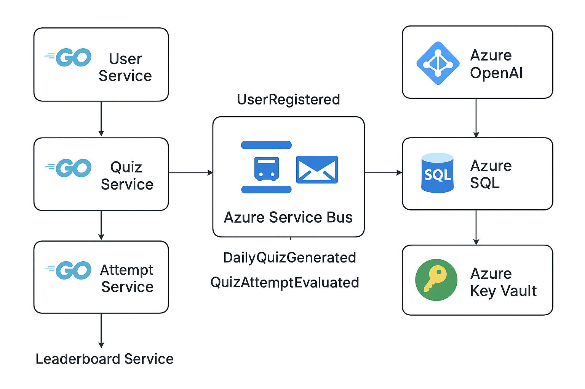

Absolutely — let’s rework the **Phase 3 action plan** with the assumption that **Phase 1 (Repository + Event Bus abstraction)** and **Phase 2 (Local microservices)** are done, and focus on **simplicity, repeatability, and production readiness** using Terraform.

Here’s a streamlined, practical plan:

---

# **Phase 3 – Cloud Lift (Simplified & Terraform-Ready)**

## **Goal**

Move fully to Azure-managed services, deploy microservices in production-ready manner, while keeping everything **simple, reproducible, and tear-down friendly**.

---

## **1. Prepare Terraform-Based Azure Infrastructure**

**Tasks:**

1. **Set up Terraform project structure**

   ```
   infra/
   ├─ main.tf         # provider + backend
   ├─ variables.tf    # configurable variables
   ├─ outputs.tf      # resource outputs
   ├─ modules/
   │   ├─ sql/
   │   ├─ servicebus/
   │   ├─ container-apps/
   │   ├─ keyvault/
   │   └─ openai/
   └─ envs/
       ├─ dev.tfvars
       ├─ staging.tfvars
       └─ prod.tfvars
   ```

2. **Resources to provision via Terraform**

   * **Azure SQL** → single DB or per service, firewall rules, managed identity.
   * **Azure Service Bus** → topics/queues for domain events: `UserRegistered`, `DailyQuizGenerated`, `QuizAttemptEvaluated`.
   * **Azure Container Apps** → one per microservice, env vars from Key Vault, HTTP ingress for APIs.
   * **Key Vault** → store DB connection strings, Service Bus keys, OpenAI key, AD B2C secrets.
   * **Azure OpenAI** → store key in Key Vault, connect Quiz service.
   * **AD B2C** → user authentication, app registrations, user flows.

3. **Environment separation**

   * Use `.tfvars` files for dev/staging/prod.
   * Simple naming convention to avoid collisions: `claude-dev-user`, `claude-prod-quiz`, etc.

4. **Local testing support**

   * Optional Terraform setup to deploy minimal dev environment for testing before full cloud deployment.

---

## **2. Containerize Microservices for Azure**

**Tasks:**

1. Dockerize each service if not done in Phase 2:

   * Base image: `golang:1.21-alpine`
   * Health checks and environment variable support
   * Logging to stdout/stderr for Container Apps

2. Set environment variables for:

   * Azure SQL connection string
   * Service Bus connection string
   * OpenAI API key
   * AD B2C JWT config

3. Test locally with Docker Compose pointing to Terraform-created dev environment (Azure SQL + Service Bus).

---

## **3. Event Bus Integration with Azure Service Bus**

**Tasks:**

1. Replace local broker (RabbitMQ/NATS) with **Azure Service Bus**.
2. Ensure services:

   * Publish domain events: `UserRegistered`, `DailyQuizGenerated`, `QuizAttemptEvaluated`
   * Subscribe and process events reliably
3. Implement simple retry/backoff on failures.
4. Keep code clean using **Event Bus interface** from Phase 1 so switching brokers is trivial.

---

## **4. Connect Repositories to Azure SQL**

**Tasks:**

1. Use **Repository interfaces** from Phase 1 to point to Azure SQL.
2. Run database migrations using **goose** or preferred tool.
3. Verify transactional consistency and optionally implement **outbox pattern** if needed.

---

## **5. Deploy Microservices to Azure Container Apps**

**Tasks:**

1. Create **Container Apps Environment** (VNet optional).
2. Deploy each service with:

   * Secrets from Key Vault
   * Scaling rules (CPU/memory, HTTP concurrency, queue length)
   * HTTP ingress for API endpoints
3. Configure internal networking for inter-service calls.

---

## **6. Integrate OpenAI & AD B2C**

1. **OpenAI**

   * Quiz service calls Azure OpenAI for quiz generation
   * Use Key Vault for API key
   * Implement basic rate limiting/error handling

2. **AD B2C**

   * JWT validation middleware for all microservices
   * Enforce role-based access (optional at first)

---

## **7. Observability & Monitoring**

1. Enable **Application Insights** for metrics, logs, and traces.
2. Monitor Service Bus queues and dead-letter messages.
3. Optional: basic alerts for failures, high latency, or queue backlogs.

---

## **8. CI/CD Pipeline (Terraform + Containers)**

1. Steps for dev/staging/prod:

   * Terraform plan & apply → provision infra
   * Build and push Docker images
   * Deploy to Container Apps
   * Run smoke tests / health checks
2. Secrets handled via Key Vault; pipelines should **never hard-code keys**.
3. Destroy environment: `terraform destroy`

---

## **9. End-to-End Validation**

1. Test full flow:

   * User registration → `UserRegistered` event → leaderboard update
   * Daily quiz generation → `DailyQuizGenerated`
   * Quiz attempt → `QuizAttemptEvaluated`
2. Verify Azure SQL writes, Service Bus messages, OpenAI calls, JWT auth.
3. Monitor logs and metrics to ensure production readiness.

---

## **10. Sequence Overview**

1. Terraform infra provisioning (SQL, Service Bus, Key Vault, OpenAI, AD B2C)
2. Containerize microservices and configure env vars
3. Integrate services with Service Bus and Azure SQL
4. Deploy services to Azure Container Apps
5. Integrate OpenAI and AD B2C
6. Configure monitoring & observability
7. Set up CI/CD pipeline
8. Validate end-to-end functionality

---

✅ **Key Principles for Simplicity + Production Readiness**

* **Terraform-managed infrastructure** → reproducible, tear-down-friendly
* **Single DB or minimal splitting** → reduce complexity
* **One Container App per service** → easy scaling
* **Secrets in Key Vault** → no hard-coded credentials
* **Event-driven via Service Bus** → keeps services decoupled

---

If you want, I can **also draw a simple visual diagram** of this Phase 3 architecture showing **services, events, and Azure resources**, which would make it extremely clear and easy to document.

Do you want me to do that next?

